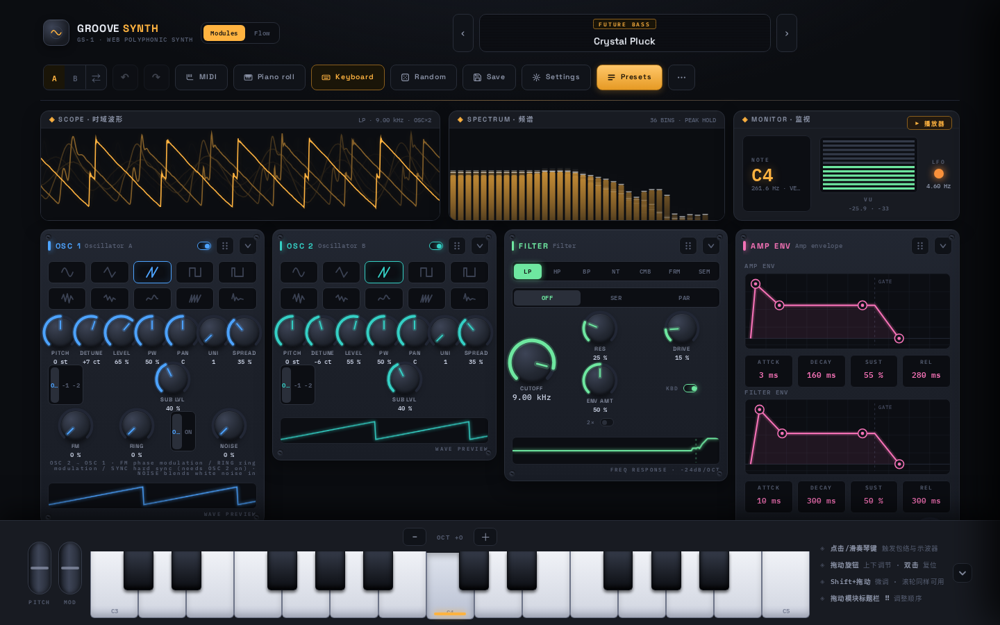
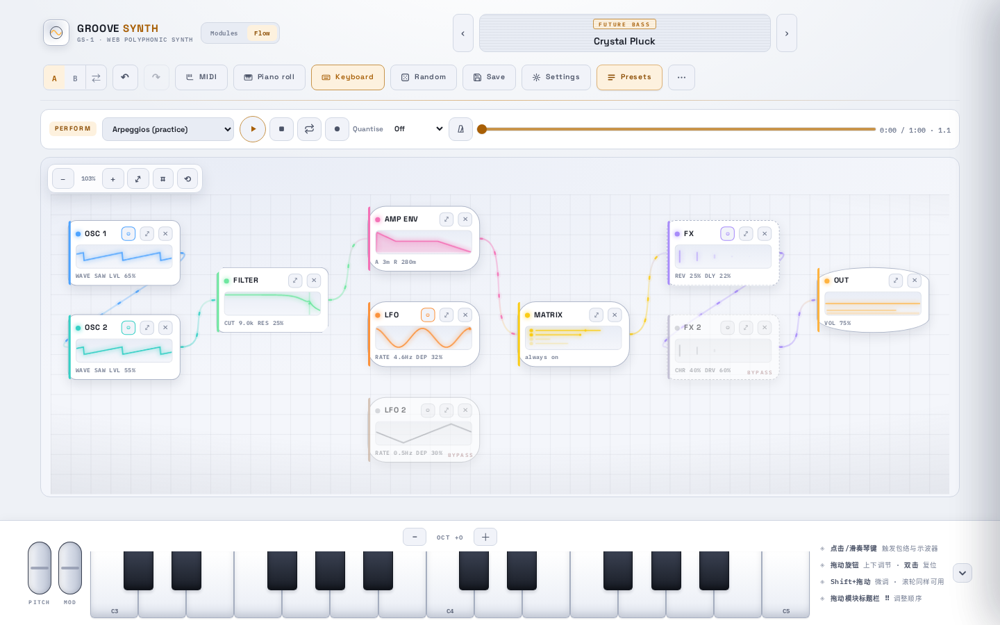
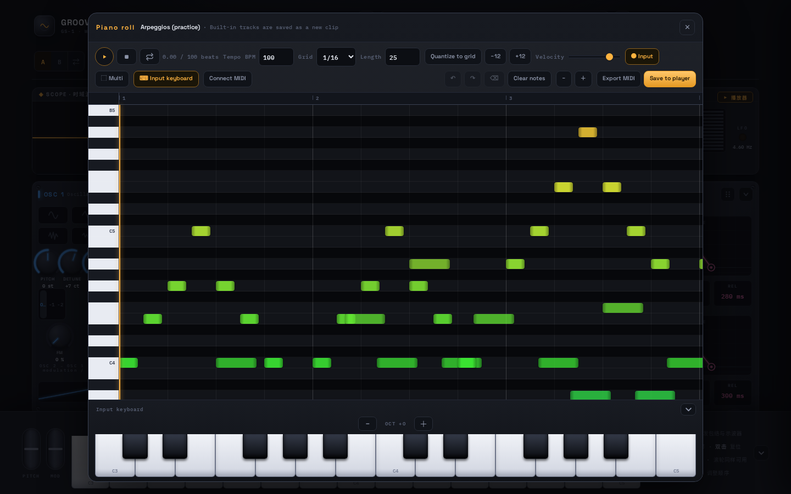

# GROOVE SYNTH GS-1

[中文](README.zh-CN.md) · English · **[Live demo](https://synth.wangda.today/)**

A polyphonic synthesizer that runs entirely in the browser, with an MCP server built in.

The DSP core is Rust, compiled to WebAssembly and rendered on the audio thread inside an
`AudioWorklet`. The interface is React and TypeScript. The app installs as an offline PWA and
makes no network requests after the first visit.

The MCP server is how other programs play it. An agent can read and write patches, import samples
and wavetables, render a performance to a WAV, and measure the result with the same rulers this
project's own test gates use — non-harmonic floor, THD, peak, largest step. Every clamped value
comes back in the reply, so a caller can see what the engine actually took instead of guessing.



 

## Features

- **Engine** — two oscillators (wavetables, single-cycle and sample import with mipmap
  anti-aliasing), three noise colours, unison with spread, FM / ring modulation / hard sync,
  per-oscillator sub, and dual-instance Layer / Split.
- **Filters** — Moog ladder (LP / HP / BP / NT), comb and formant. Each oscillator gets its own
  filter and equal-power panning.
- **Modulation** — two per-voice LFOs (retrigger / one-shot), an 8-slot modulation matrix, and
  aftertouch / random / key / velocity / wheel sources.
- **Effects** — six effect nodes wired as a feed-forward graph: ping-pong delay, convolution
  reverb with IR import, chorus, flanger, phaser and overdrive, with per-node oversampling.
- **Playing** — on-screen keyboard with multi-touch chords, glissando and touch-position velocity;
  pitch and mod wheels; Web MIDI; MPE; microtuning (four temperaments and `.scl`); chord detection;
  a practice mode.
- **Writing** — MIDI player with 25 built-in pieces and `.mid` import, recording, a piano roll, a
  multi-track timeline with clips, and export to `.mid`, WAV or MP3.
- **Presets and projects** — 91 factory presets, `.gs1.json` import/export, share codes, A/B
  compare, undo/redo, and multiple projects (`.gs1proj`).
- **App** — Chinese / English interface, dark / light / auto theme plus a high-contrast mode,
  layouts for desktop, iPad and iPhone, and a built-in guide on synthesis basics, synthesizer
  history and how each module works.
- **Offline** — the service worker precaches the app shell (JS, CSS, WASM, worklet, fonts, icons).

## The MCP server

Sixteen offline tools and five browser tools. [`docs/LLM-INTERFACE.md`](docs/LLM-INTERFACE.md) is
the contract — names, inputs, return fields, error codes and limits — and
`scripts/verify-llm-docs.mjs` checks it against the live registry in both directions.

```bash
npm run mcp                  # stdio, for an MCP client
npm run mcp -- --http        # loopback HTTP
npm run mcp -- --self-test   # run the whole tool surface twice and compare
```

What a caller can do with it:

- **Read** — the parameter table, the presets, the songs list, and the engine's build.
  `gs1.describe` reports the ABI, the arena and the sampler limits read out of the Rust that
  defines them, not out of a second table.
- **Write** — set a patch from a share code, a preset or `{key: value}` edits; randomise it; move
  it along a named attribute (`gs1.patch.morph` — warmth, air, brightness, width, softness, each a
  documented set of parameter moves); step back with `gs1.patch.undo`.
- **Play** — `gs1.render` takes a note list, a built-in song by `songId`, or a standard MIDI file
  as base64, and writes a 16-bit stereo WAV. Deterministic for a given patch, notes, seconds and
  seed.
- **Measure** — `gs1.analyze` and `gs1.gate` run the same Blackman-Harris and Hann rulers
  `verify-audio` uses, and every number is labelled with the ruler that produced it.

The tools are also what the unit tests drive: `mcp/mcp.test.mjs` and `mcp/ops.test.mjs` speak
JSON-RPC to them over a hand-written transport, and `npm run ui:smoke` drives the browser layer.

## How it is put together

```
React UI  ──AudioParam (k-rate)──┐
          ──MessagePort + transferable buffers──┐
                                    ▼
                          AudioWorklet render thread
                          gs_set_param / gs_process(frames)
                                    ▼
                    Rust core (crates/synth-core → wasm32)
                    voice manager, oscillators, filters, effects, FFT
```

The real-time thread never allocates: the Rust side uses a fixed arena shared with the vendored
C / C++ DSP code, and `memory.grow` during rendering is zero. Parameters are exposed as k-rate
`AudioParam`s so the browser handles interpolation and thread synchronisation; note events travel
over a `MessagePort` with transferable buffers. The core is built twice — WebAssembly SIMD and a
scalar fallback — and the engine picks one at runtime. There is no `SharedArrayBuffer`, so the app
needs no COOP/COEP headers and can be embedded in an iframe.

## Getting started

Requirements:

| Tool | Version | Purpose |
| :--- | :--- | :--- |
| Node.js | >= 20 | front-end build and tooling |
| Rust | stable, with `wasm32-unknown-unknown` | DSP core |
| clang | >= 16 with wasm support | compiling the vendored C / C++ DSP |
| `llvm-ar` | ships with LLVM | archiving C / C++ objects |

```bash
rustup target add wasm32-unknown-unknown
npm install
npm run dev        # builds the WASM core, then serves http://localhost:3000
```

The Rust core depends on no crates.io packages, so `cargo build` works offline.

| Command | What it does |
| :--- | :--- |
| `npm run dev` | build the WASM core and start the dev server |
| `npm run build` | WASM + type check + production build + service worker |
| `npm run preview` | serve the production build locally |
| `npm run package` | build and write deployment archives to `release/` |
| `npm test` | front-end unit and Worklet integration tests |
| `npm run test:rust` | Rust unit tests |
| `npm run test:wasm` | WASM integration checks (frequency accuracy, block sizes, polyphony) |
| `npm run test:dsp` | DSP regression baseline |
| `npm run test:e2e` | Playwright end-to-end tests (`npx playwright install chromium` first) |
| `npm run lint` | ESLint |
| `npm run verify` | the full gate chain, the same one CI runs |

`npm run verify` covers Clippy, Rust tests, the build, unit tests, lint, the WASM gates, dist and
budget checks, audio measurements, preset fingerprints, the DSP baseline and the MCP self-test. It
is slow; `npm test` and `npm run test:rust` are the quick loops.

## Documentation

- [`docs/USER-GUIDE.md`](docs/USER-GUIDE.md) — how to play and use the synthesizer.
- [`docs/LLM-INTERFACE.md`](docs/LLM-INTERFACE.md) — the MCP contract, with a worked example.
- [`docs/DSP-GUIDE.md`](docs/DSP-GUIDE.md) — the acoustics and signal processing behind each
  module, tied to the actual files and constants.
- [`docs/DEVICE-TESTING.md`](docs/DEVICE-TESTING.md) — the on-device regression checklist.
- [`docs/ROADMAP.md`](docs/ROADMAP.md) — what is done and what is planned.
- [`docs/notes/`](docs/notes/) — engineering notes on specific problems, measurements and fixes.
- [`prd.md`](prd.md) — the original design brief.

## License

MIT. See [`LICENSE`](LICENSE).

Vendored DSP sources (DaisySP, Soundpipe) and other third-party components are listed in
[`THIRD_PARTY_NOTICES.md`](THIRD_PARTY_NOTICES.md).
