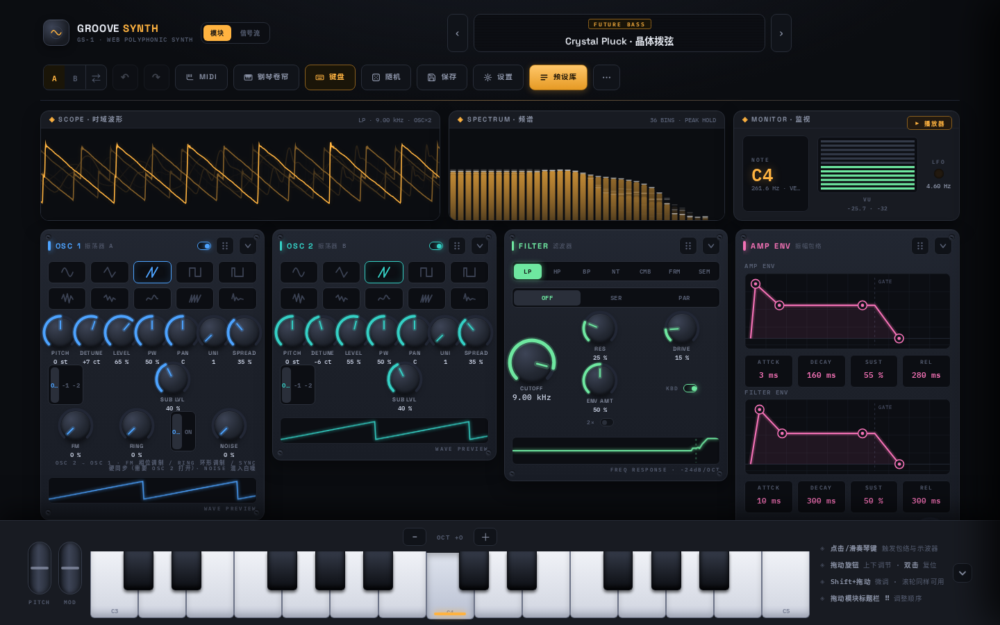
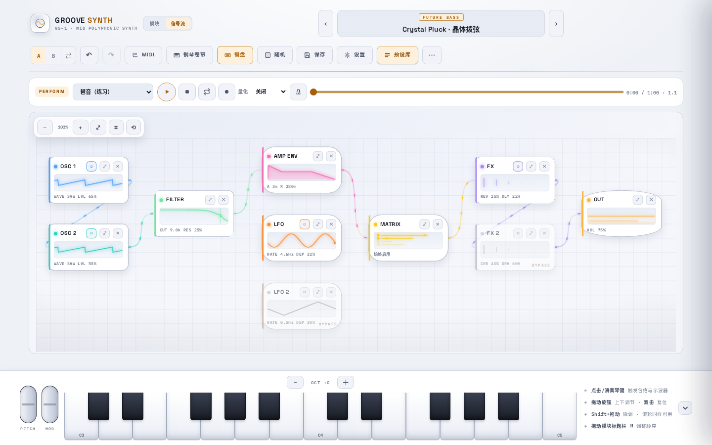
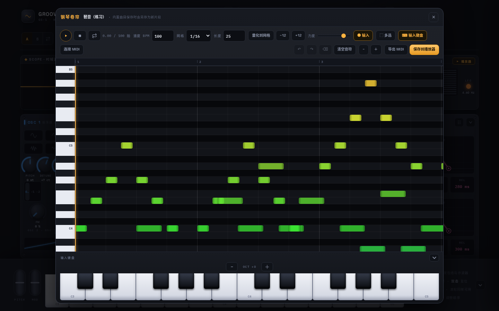
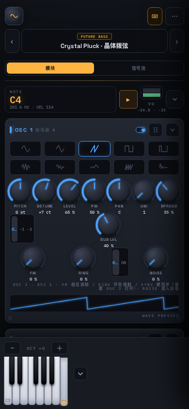

# GROOVE SYNTH GS-1

中文 · [English](README.md) · **[在线体验](https://synth.wangda.today/)**

一个完全跑在浏览器里的复音合成器，自带一个 MCP 服务。

DSP 核心用 Rust 写成、编译为 WebAssembly，在 `AudioWorklet` 的音频线程里渲染；界面是 React +
TypeScript。整个应用可以作为离线 PWA 安装，首次访问之后不再发起任何网络请求。

MCP 服务是给别的程序用的入口。agent 可以读写音色、导入采样与波表、把一段演奏渲染成 WAV，并用
**本仓库门禁自己那套尺子**量出结果——非谐波地板、THD、峰值、最大步进。所有被夹取的数值都会随结果
返回，调用方看到的是引擎真正接受的量，不用猜。



 



## 功能

- **合成引擎** — 双振荡器（波表，以及带 mipmap 抗混叠的单周期 / 采样导入）、三色噪声、
  Unison 与 SPREAD、FM / 环形调制 / 硬同步、每振荡器 sub、双实例 Layer / Split。
- **滤波** — Moog 阶梯（LP / HP / BP / NT）、梳状、共振峰；每个振荡器独立滤波与等功率声像。
- **调制** — 每声部两个 LFO（RETRIG / ONE SHOT）、8 槽调制矩阵，以及 AFTER / RANDOM / KEY /
  VELO / WHEEL 调制源。
- **效果** — 6 个效果节点组成前馈路由图：乒乓延迟、可导入 IR 的卷积混响、合唱、镶边、移相、
  过载，并支持逐节点过采样。
- **演奏** — 屏幕键盘支持多指和弦、滑奏与按触点位置的力度；弯音 / 调制轮；Web MIDI；MPE；
  微调律（4 种律制与 `.scl`）；和弦识别；练习模式。
- **创作** — MIDI 播放器（内置 25 首曲目，可导入 `.mid`）、录制、钢琴卷帘、带片段的多轨时间线，
  以及导出 `.mid`、WAV、MP3。
- **预设与工程** — 91 个工厂预设、`.gs1.json` 导入导出、分享码、A/B 对比、撤销重做，
  以及多套工程（`.gs1proj`）。
- **应用** — 中文 / English 界面，深色 / 浅色 / 跟随系统与高对比模式，桌面、iPad、iPhone 各自
  优化的布局，内置合成原理、合成器简史与各模块详解的离线指南。
- **离线** — Service Worker 预缓存整个 app shell（JS、CSS、WASM、worklet、字体、图标）。

## MCP 服务

16 个离线工具 + 5 个浏览器工具。契约写在 [`docs/LLM-INTERFACE.md`](docs/LLM-INTERFACE.md)——
名字、输入、返回字段、错误码与上限——由 `scripts/verify-llm-docs.mjs` 与真实注册表**双向核对**。

```bash
npm run mcp                  # stdio，给 MCP 客户端用
npm run mcp -- --http        # 回环 HTTP
npm run mcp -- --self-test   # 把整个工具面跑两遍并逐字节比对
```

调用方能做四类事：

- **读** — 参数表、预设、曲库，以及引擎自身的构建信息。`gs1.describe` 报的 ABI、arena 与采样器
  上限是**从定义它们的 Rust 里读出来的**，不是第二份表。
- **写** — 用分享码 / 预设 / `{key: value}` 设置音色；随机化；沿一个有名字的属性移动
  （`gs1.patch.morph`——warmth、air、brightness、width、softness，每个都是一组写明了的参数动作）；
  用 `gs1.patch.undo` 退回上一步。
- **演奏** — `gs1.render` 接受音符列表、内置曲的 `songId`，或 base64 的标准 MIDI 文件，写出
  16 位立体声 WAV。给定 patch、音符、时长与 seed 时逐字节确定。
- **测量** — `gs1.analyze` 与 `gs1.gate` 用的是 `verify-audio` 那两把 Blackman-Harris 与 Hann
  尺子，每个数字都标注了它出自哪把尺子。

这些工具同时也是单测的驱动对象：`mcp/mcp.test.mjs` 与 `mcp/ops.test.mjs` 用一套手写的 JSON-RPC
传输直接调它们，`npm run ui:smoke` 则驱动浏览器层。

## 架构

```
React 界面 ──AudioParam (k-rate)──────────┐
           ──MessagePort + Transferable──┐ │
                                        ▼ ▼
                             AudioWorklet 渲染线程
                             gs_set_param / gs_process(frames)
                                        ▼
                       Rust 核心（crates/synth-core → wasm32）
                       声部管理、振荡器、滤波、效果、FFT
```

实时线程不做任何分配：Rust 侧使用一块固定 arena，与 vendor 进来的 C / C++ DSP 共用，渲染期间
`memory.grow` 为 0。参数以 k-rate `AudioParam` 暴露，插值与线程同步交给浏览器；音符事件通过
`MessagePort` 和 Transferable 缓冲区传递。核心编译两份——WebAssembly SIMD 与标量回退——由引擎在
运行时探测选择。没有用 `SharedArrayBuffer`，因此不需要 COOP / COEP 响应头，可以直接嵌进 iframe。

## 开始使用

依赖：

| 工具 | 版本 | 用途 |
| :--- | :--- | :--- |
| Node.js | >= 20 | 前端构建与工具链 |
| Rust | stable，带 `wasm32-unknown-unknown` | DSP 核心 |
| clang | >= 16，支持 wasm | 编译 vendor 的 C / C++ DSP |
| `llvm-ar` | 随 LLVM | 归档 C / C++ 目标文件 |

```bash
rustup target add wasm32-unknown-unknown
npm install
npm run dev        # 编译 WASM 核心，然后启动 http://localhost:3000
```

Rust 核心不依赖任何 crates.io 包，`cargo build` 可以完全离线完成。

| 命令 | 作用 |
| :--- | :--- |
| `npm run dev` | 编译 WASM 核心并启动开发服务器 |
| `npm run build` | WASM + 类型检查 + 生产构建 + 生成 Service Worker |
| `npm run preview` | 本地预览生产构建 |
| `npm run package` | 构建并输出部署包到 `release/` |
| `npm test` | 前端单元测试与 Worklet 集成测试 |
| `npm run test:rust` | Rust 单元测试 |
| `npm run test:wasm` | WASM 集成校验（频率精度、动态块、复音） |
| `npm run test:dsp` | DSP 回归基线 |
| `npm run test:e2e` | Playwright 端到端测试（先执行 `npx playwright install chromium`） |
| `npm run lint` | ESLint |
| `npm run verify` | 完整门禁链，与 CI 相同 |

`npm run verify` 串联 Clippy、Rust 测试、构建、单元测试、lint、WASM 门禁、产物与体积校验、
音频测量、预设指纹、DSP 基线与 MCP 自检。它跑得很慢；日常开发用 `npm test` 和
`npm run test:rust`。

## 文档

- [`docs/USER-GUIDE.md`](docs/USER-GUIDE.md) — 演奏与操作说明。
- [`docs/LLM-INTERFACE.md`](docs/LLM-INTERFACE.md) — MCP 契约，附一个跑通的范例。
- [`docs/DSP-GUIDE.md`](docs/DSP-GUIDE.md) — 各模块背后的声学与信号处理原理，对应到真实的
  文件、常量与实测数字。
- [`docs/DEVICE-TESTING.md`](docs/DEVICE-TESTING.md) — 真机回归清单。
- [`docs/ROADMAP.md`](docs/ROADMAP.md) — 已完成与后续规划。
- [`docs/notes/`](docs/notes/) — 针对具体问题、测量与修复的工程笔记。
- [`prd.md`](prd.md) — 最初的设计文档。

## 许可证

MIT，见 [`LICENSE`](LICENSE)。

vendor 的 DSP 源码（DaisySP、Soundpipe）及其它第三方组件见
[`THIRD_PARTY_NOTICES.md`](THIRD_PARTY_NOTICES.md)。
