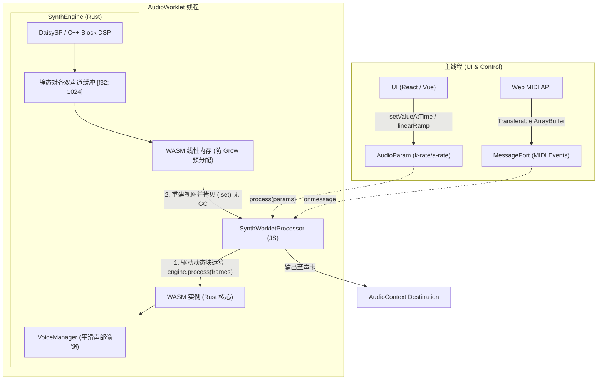

# Groove Synth 合成器板块 · 工业级 WebAssembly 架构设计文档 

---

## 1. 设计原则与核心技术指标

本设计旨在构建一个**工业级、低延迟、零内存抖动**的 Web 合成器。底层通过 Rust 统领整体架构，利用严谨的内存模型消除并发数据竞争，并通过 **Block-based（块处理）C ABI** 无缝复用顶级开源 C/C++ DSP 算法；在前端通过 Web Audio (AudioWorklet) 运行 WASM 核心，实现专业级声音合成。

### 1.1 核心设计原则

| 原则 | 描述 | 架构落地方式 |
| :--- | :--- | :--- |
| **实时无锁与零分配** | 音频渲染线程禁止任何堆内存申请、释放及阻塞性锁 | 预分配静态缓冲区，自定义全局分配器防止 `memory.grow`，WASM 渲染循环零 GC 开销 |
| **拥抱原生并发模型** | 杜绝手动实现复杂的参数同步与平滑，避免重复造轮子 | 全面采用 Web Audio 原生 `AudioParam` (k-rate/a-rate) 处理参数插值与线程同步 |
| **高吞吐动态块 FFI** | 杜绝单样本（Per-sample）跨语言 FFI 产生的堆栈开销 | 强制推行 **动态帧数（128~1024）** 块处理 ABI，适配不同硬件与宿主环境 |
| **SIMD 安全与对齐** | 解决 WASM 裸指针 SIMD 加载导致的内存未对齐 Trap 崩溃 | 采用 Rust `core::simd` (Portable SIMD)，由编译器保障内存对齐与向量化安全 |
| **平滑降级与防破音** | 杜绝性能抖动导致的音频撕裂与声部硬切断爆音 | 引入 JS 侧耗时监控，触发降级时执行**平滑释放 (Smooth Release)** 的声部偷窃算法 |

### 1.2 工业级技术指标

```yaml
# 性能指标（基准：16 复音，双振荡器 + 滤波器 + 2 效果器，48kHz，桌面平台）
音频渲染周期: 动态适配 128 ~ 1024 样本帧 (依宿主 AudioContext 设定)
内部处理延迟: < 0.5ms (128 帧处理耗时占比 < 18%)
端到端发声延迟: < 15ms (含系统音频输出驱动与输入事件响应)
CPU 资源占用: < 20% (16 复音基准状态)
实时线程内存分配: 0 Bytes (process 循环运行时堆分配严格为零，禁止 memory.grow)
WASM 模块体积: < 3.5MB (Gzip 压缩后 < 1.2MB，含基础音色表)

# 规格与容量
最大并行复音: 8 / 16 / 32 可配置 (超出自动激活平滑声部偷窃算法)
控制参数容量: 256 个 AudioParam (由浏览器底层保障无锁同步与插值)
事件通道带宽: MessagePort + Transferable 支持高频 MIDI 事件零拷贝并发
```

---

## 2. 开源 DSP 库选型与 C FFI 块处理架构

### 2.1 依赖库矩阵与选型重构

原架构方案移除了对 WASM 交叉编译极不友好的现代重模板库（如 KFR），频谱分析全面替换为纯 Rust 生态最优的 `rustfft`。

| 库名 | 语言 | 承担模块 | 引入模式 | 编译工具链适配 |
| :--- | :--- | :--- | :--- | :--- |
| **DaisySP** | C++ | 振荡器、经典模拟滤波、包络 | 块处理 C ABI 包装 | `clang --target=wasm32` 静态编译 `.a` |
| **Soundpipe** | C | 延迟类、混响类效果器 | 纯 C 接口直接绑定 | `cc` crate 驱动构建 |
| **Faust** | Faust DSL | 物理建模、复合效果器 | 编译为 C 代码集成 | 离线转译为 C 代码加入工程编译 (原生支持 SIMD/Block) |
| **rustfft** | Rust | 频谱分析、FFT、IFFT | Cargo 原生依赖 | 纯 Rust，原生支持 WASM SIMD |

### 2.2 块处理（Block-Based）C ABI 规约与局限性澄清

为消除单样本 FFI 调用引起的函数栈频繁压栈，C 接口统一修改为**数组指针 + 块长度**的形式。
*注：DaisySP 等库底层仍为单样本状态机，C 层的 `for` 循环主要目的是**收敛 FFI 边界开销**，而非实现 DSP 内部的 SIMD 向量化。对于极致性能需求的核心模块，推荐转用 Faust 导出或纯 Rust SIMD 重写。*

#### C++ 包装实现 (`daisy_core_c.cpp`)
```cpp
#include "daisysp.h"
#include "daisy_core_c.h"

extern "C" {

// 块级渲染：收敛 FFI 边界，内部紧凑循环
void daisy_osc_process_block(DaisyOscHandle handle, float* output, size_t frames) {
    auto* osc = reinterpret_cast<daisysp::Oscillator*>(handle);
    for (size_t i = 0; i < frames; ++i) {
        output[i] = osc->Process();
    }
}

}
```

---

## 3. WebAssembly 与 AudioWorklet 核心架构（动态块与零拷贝）

### 3.1 系统拓扑设计

彻底废弃复杂且易错的 `SharedArrayBuffer` 参数同步，全面拥抱 Web Audio 原生并发模型。



### 3.2 Rust 核心引擎实现 (`src/engine.rs`)

核心原则：**彻底移除内部参数平滑器，接收 JS 传入的插值后参数数组；支持动态 Buffer Size。**

```rust
use wasm_bindgen::prelude::*;

// 预分配最大可能的 Buffer Size (适配 1024 帧的宿主环境)
pub const MAX_BLOCK_SIZE: usize = 1024; 

extern "C" {
    fn daisy_osc_create(sample_rate: f32) -> *mut std::ffi::c_void;
    fn daisy_osc_destroy(handle: *mut std::ffi::c_void);
    fn daisy_osc_process_block(handle: *mut std::ffi::c_void, output: *mut f32, frames: usize);
}

#[wasm_bindgen]
pub struct SynthEngine {
    sample_rate: f32,
    // 预分配最大尺寸，避免运行时分配
    output_buffer_left: [f32; MAX_BLOCK_SIZE],
    output_buffer_right: [f32; MAX_BLOCK_SIZE],
    osc_handle: *mut std::ffi::c_void,
}

#[wasm_bindgen]
impl SynthEngine {
    #[wasm_bindgen(constructor)]
    pub fn new(sample_rate: f32) -> Self {
        let osc_handle = unsafe { daisy_osc_create(sample_rate) };
        Self {
            sample_rate,
            output_buffer_left: [0.0; MAX_BLOCK_SIZE],
            output_buffer_right: [0.0; MAX_BLOCK_SIZE],
            osc_handle,
        }
    }

    #[inline(always)]
    pub fn get_left_channel_ptr(&self) -> *const f32 {
        self.output_buffer_left.as_ptr()
    }

    // 接收动态帧数，并由 JS 侧传入已经过 AudioParam 插值的参数
    pub fn process(&mut self, frames: usize, freq_param: f32) {
        // 1. 清除上一次渲染产生的残余数据 (仅清除实际帧数)
        self.output_buffer_left[..frames].fill(0.0);

        // 2. 更新 DSP 参数 (AudioParam 已在 JS 侧完成平滑插值)
        unsafe {
            // 假设此处有 set_freq 的 FFI
            // daisy_osc_set_freq(self.osc_handle, freq_param);
            
            // 3. 块渲染调用
            daisy_osc_process_block(
                self.osc_handle,
                self.output_buffer_left.as_mut_ptr(),
                frames,
            );
        }

        // 4. 复制单声道到右声道
        self.output_buffer_right[..frames].copy_from_slice(&self.output_buffer_left[..frames]);
    }
}
```

### 3.3 AudioWorklet 端高性能驱动实现 (`synth-processor.js`)

在 JS 侧动态获取 Block Size，每次重建 TypedArray 视图以防止 WASM `memory.grow` 导致的 Detach 崩溃。

```javascript
class SynthWorkletProcessor extends AudioWorkletProcessor {
    constructor(options) {
        super();
        const { wasmModule, sampleRate } = options.processorOptions;

        this.wasmInstance = new WebAssembly.Instance(wasmModule, {
            env: { memory: new WebAssembly.Memory({ initial: 256, maximum: 512, shared: false }) }
        });

        this.engine = new this.wasmInstance.exports.SynthEngine(sampleRate);
        this.wasmMemory = this.wasmInstance.exports.memory;
        this.leftPtr = this.engine.get_left_channel_ptr();
        
        // 监听 MIDI 事件 (Transferable 零拷贝)
        this.port.onmessage = (e) => this.handleMidiEvent(e.data);
    }

    process(inputs, outputs, parameters) {
        const output = outputs[0];
        const outLeft = output[0];
        const outRight = output[1];
        
        // 动态获取当前宿主环境的 Block Size (128, 256, 512 等)
        const blockSize = outLeft.length; 
        
        // 提取 AudioParam 插值后的当前块参数值 (k-rate)
        // 假设 parameter 0 为 frequency
        const freqParam = parameters['frequency'][0]; 

        // 1. 驱动 Rust 执行动态块渲染
        this.engine.process(blockSize, freqParam);

        // 2. 每次重建 TypedArray 视图 (极低成本)，彻底杜绝 memory.grow 导致的 Detach 崩溃
        const leftView = new Float32Array(this.wasmMemory.buffer, this.leftPtr, blockSize);
        
        // 3. 极速拷贝至 Web Audio 硬件底层驱动
        outLeft.set(leftView);
        if (outRight) {
            // 右声道指针偏移计算 (假设连续内存)
            const rightPtr = this.leftPtr + (blockSize * 4); 
            const rightView = new Float32Array(this.wasmMemory.buffer, rightPtr, blockSize);
            outRight.set(rightView);
        }

        return true; 
    }
}
registerProcessor('synth-worklet-processor', SynthWorkletProcessor);
```

---

## 4. 线程模型与无锁并发控制

### 4.1 移除 SAB 依赖，采用 Transferable 零拷贝 MIDI 传递

由于音频参数同步已交由 `AudioParam` 处理，系统不再强依赖 `SharedArrayBuffer`，从而完美兼容第三方 iframe 嵌入环境（无需配置复杂的 COOP/COEP 响应头）。

对于 MIDI NoteOn/NoteOff 等离散事件，采用 `MessagePort` 结合 `Transferable Objects` 实现零拷贝传递：

```javascript
// 主线程发送 MIDI 事件
const eventBuffer = new Uint8Array([0x90, 60, 127]); // NoteOn
workletNode.port.postMessage(eventBuffer, [eventBuffer.buffer]); // 转移所有权，零拷贝

// Worklet 线程接收
this.port.onmessage = (e) => {
    const midiData = new Uint8Array(e.data);
    // 直接解析并送入 WASM 的 SPSC 队列
    this.engine.push_midi_event(midiData[0], midiData[1], midiData[2]);
};
```

---

## 5. DSP 引擎实现细节与算法设计

### 5.1 废弃手动 IIR，拥抱 AudioParam 原生平滑

**设计变更**：移除 WASM 内部的 `OnePoleSmoother`。
**理由**：Web Audio API 的 `AudioParam` (如 `frequency.linearRampToValueAtTime`) 底层由浏览器 C++ 引擎实现，天然具备线程安全、无锁且声学正确的块级插值（k-rate/a-rate）能力。在 WASM 内重复实现不仅增加代码体积，还容易引入相位计算误差。

### 5.2 安全的 SIMD 加速实现 (Portable SIMD)

废弃裸指针的 `v128_load`（易引发未对齐 Trap），改用 Rust 原生的 `core::simd`，由编译器保障内存对齐与向量化安全。

```rust
// src/dsp/simd_mixer.rs
#![feature(portable_simd)]
use core::simd::f32x4;

/// SIMD 加速多声部混音叠加：out[n] = out[n] + (in[n] * gain)
pub fn accumulate_block_simd(input: &[f32], output: &mut [f32], gain: f32) {
    let gain_vec = f32x4::splat(gain);
    
    // 使用 chunks_exact 自动处理对齐与边界问题，杜绝 Trap
    let (in_chunks, in_remainder) = input.as_simd::<4>();
    let (out_chunks, out_remainder) = output.as_simd_mut::<4>();

    for (in_chunk, out_chunk) in in_chunks.iter().zip(out_chunks.iter_mut()) {
        let scaled = *in_chunk * gain_vec;
        *out_chunk += scaled;
    }

    // 标量处理剩余样本
    for (i, o) in in_remainder.iter().zip(out_remainder.iter_mut()) {
        *o += *i * gain;
    }
}
```

### 5.3 核心模块分发：枚举优化替代动态虚表（Enum Dispatch）

保持原有设计，利用 Rust 静态多态消除虚表开销，确保 C FFI 调用被完美内联。

```rust
pub enum FilterNode {
    DaisyMoog(DaisyFilterHandle),
    Bypass,
}

impl FilterNode {
    #[inline(always)]
    pub fn process_block(&mut self, input: &[f32], output: &mut [f32]) {
        match self {
            Self::DaisyMoog(handle) => {
                unsafe { daisy_filter_process_moog_block(*handle, input.as_ptr(), output.as_mut_ptr(), input.len()) };
            }
            Self::Bypass => {
                output.copy_from_slice(input);
            }
        }
    }
}
```

---

## 6. 工具链与交叉编译工程配置

### 6.1 自定义全局分配器（防止 `memory.grow`）

在实时音频线程中，WASM 内存页的扩容（`memory.grow`）会导致严重的卡顿和 TypedArray Detach。必须使用轻量级分配器并预分配足够内存。

```rust
// src/lib.rs
use wee_alloc::WeeAlloc;

#[global_allocator]
static ALLOC: WeeAlloc = WeeAlloc::INIT;
```

### 6.2 跨语言自动编译脚本 (`build.rs`)

显式指定 `clang` 编译器，确保 CI/CD 环境下的 WASM 交叉编译稳定性。

```rust
// build.rs
fn main() {
    let target = env::var("TARGET").unwrap_or_default();

    if target.contains("wasm32") {
        let mut build = cc::Build::new();

        build
            .cpp(true)
            .std("c++17")
            .compiler("clang") // 显式指定支持 wasm target 的 clang
            .no_default_flags(true)
            .flag("-target")
            .flag("wasm32-unknown-unknown")
            .flag("-msimd128")
            .flag("-O3")
            .flag("-flto")
            .flag("-fno-exceptions")
            .flag("-fno-rtti")
            .include("cpp_dsp/daisysp")
            .file("cpp_dsp/daisysp/Oscillator.cpp")
            .file("cpp_dsp/wrapper/daisy_core_c.cpp");

        build.compile("daisysp_wasm");
    }
}
```

---

## 7. 性能优化与自适应弹性降级策略

### 7.1 JS 侧性能监控与平滑声部偷窃

将高精度耗时统计移至 JS 侧，避免 WASM 内部调用系统时钟 API 破坏实时性。降级时触发**平滑释放 (Smooth Release)**，避免硬切断产生爆音。

```javascript
// synth-worklet-processor.js
process(inputs, outputs, parameters) {
    const startTime = performance.now();
    
    // ... 执行 WASM process ...
    
    const renderCostMs = performance.now() - startTime;
    
    // 如果单块渲染耗时超过安全阈值 (如 2.0ms)
    if (renderCostMs > 2.0) {
        // 通知 WASM 触发平滑降级 (减少复音上限，并淡出多余声部)
        this.engine.trigger_smooth_downgrade();
    }
    
    // ... 拷贝输出 ...
}
```

**Rust 侧平滑降级逻辑**：
```rust
pub fn trigger_smooth_downgrade(&mut self) {
    if self.max_polyphony > 4 {
        self.max_polyphony -= 2;
        // 关键：不直接切断声音，而是将超出新上限的声部包络(Envelope)强制进入 Release 阶段
        self.voice_manager.force_release_excess_voices(self.max_polyphony);
    }
}
```

---

## 8. 生产部署与安全沙箱应对方案

### 8.1 极简部署策略（无惧跨域隔离限制）

由于移除了对 `SharedArrayBuffer` 的强依赖（参数同步交由 `AudioParam`，MIDI 交由 `Transferable MessagePort`），本架构**不再要求**服务器必须配置 `Cross-Origin-Opener-Policy` (COOP) 和 `Cross-Origin-Embedder-Policy` (COEP)。

这使得 Groove Synth 可以作为标准 Web Component，无缝嵌入到任何第三方网页、Notion 页面或在线 DAW 的 iframe 中，极大拓宽了商业落地场景。

---

## 9. 自动化验证与质量门禁策略

### 9.1 音频正确性测试流水线 (修正内存读取)

在离线测试中，避免直接操作 WASM 裸指针，而是通过 `wasm_bindgen` 导出安全的 Rust `Vec` 接口供测试框架断言。

```rust
#[cfg(test)]
mod tests {
    use super::*;

    // 专门用于测试的导出方法，安全拷贝内部缓冲
    #[wasm_bindgen]
    pub fn get_rendered_audio(&self, frames: usize) -> Vec<f32> {
        self.output_buffer_left[..frames].to_vec()
    }

    #[test]
    fn test_daisy_osc_frequency_accuracy() {
        let sample_rate = 48000.0;
        let mut engine = SynthEngine::new(sample_rate);
        
        let mut rendered_audio = Vec::with_capacity(48000);
        let block_size = 128;
        
        // 离线渲染 1 秒数据
        for _ in 0..(48000 / block_size) {
            engine.process(block_size, 1000.0); // 注入 1000Hz 参数
            let block = engine.get_rendered_audio(block_size);
            rendered_audio.extend_from_slice(&block);
        }

        // 使用 RustFFT 分析峰值频谱点
        let detected_freq = analyze_peak_frequency(&rendered_audio, sample_rate);
        assert!((detected_freq - 1000.0).abs() < 1.0, "频率漂移超限: {}", detected_freq);
    }
}
```

### 9.2 内存泄漏与非预期分配门禁

在 CI 中集成 `wasm-bindgen-test`，并在测试环境中注入自定义的 `AllocHook`。如果在 `engine.process()` 执行期间检测到任何 `alloc` 或 `dealloc` 调用，测试用例将直接 Panic，确保实时线程的**绝对零分配**承诺。
